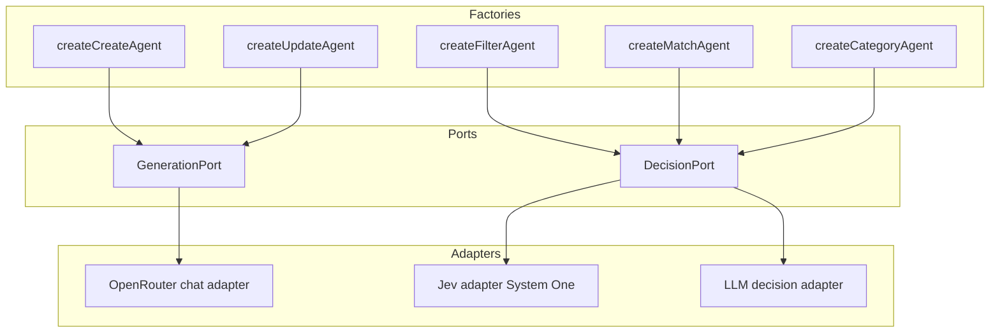

# План реализации: интеграция Jev (System One) в Reddit-пайплайн

## 1. Цель

Добавить в пайплайн второй тип движка — **DecisionPort** (типизированные решения
`noul`/`choice`/`score`) с реализациями **Jev** (TypeSafe System One через
OpenRouter) и **LLM** (fallback/A-B). Перевести на него агенты `filter`, `match`
и новый `category`. Агенты `create`/`update` остаются на **GenerationPort**
(OpenRouter chat completions).

Дополнительно:
- **Реструктуризация папок**: агенты, движки и tools разнести по отдельным
  верхнеуровневым каталогам.
- **Обратная совместимость**: старые `filter`/`match` (LLM, без Jev) остаются
  полностью рабочими и выбираются бэкендом `llm` (дефолт).
- **Убрать поле `reason`** из решения `match` полностью — и для Jev, и для LLM.
- **Пороги по умолчанию `0.8`**.

Ключевой принцип: **публичные контракты агентов не меняются** — меняется только
внутренняя реализация, выбираемая фабрикой по `backend`.

## 2. Архитектура

### 2.1. Два порта (capability)



- **GenerationPort** — бывший [`agents/provider`](scripts/reddit-pipeline/agents/provider/index.ts:1),
  переезжает в `engines/generation/` (`createProvider` +
  [`generateStructured()`](scripts/reddit-pipeline/agents/provider/lib/helpers.ts:143)).
- **DecisionPort** — новый порт в `engines/decision/`. Тонкая обёртка над
  System One API: `decide({ state, questions }) → { answers, model, usage }`.

### 2.2. Транспорт Jev

По документации TypeSafe SDK:
- base URL: `https://openrouter.ai/api` (SDK добавляет `/v1/systemone`);
- auth: `Authorization: Bearer <OPENROUTER_API_KEY>`;
- модель: `jev-1.13` (роутится как `typesafe/jev-1.13`) или `typesafe/jev-1.13`;
- вызов: `client.systemOne({ model, state, questions })`.

**Решение**: использовать `@typesafe-ai/sdk` как транспорт по умолчанию, но
изолировать его за инъектируемой функцией `systemOne` (по аналогии с
инъекцией `generate` в [`generateStructured()`](scripts/reddit-pipeline/agents/provider/lib/helpers.ts:143)).
Это даёт тестируемость без сети и возможность заменить SDK на raw `fetch`,
если alpha-эндпоинт изменится.

### 2.3. Матрица бэкендов

| Агент | Jev | LLM (старое поведение) | Порт |
|---|---|---|---|
| `filter` | `noul` + порог | текущий | DecisionPort |
| `match` | `choice` по кандидатам | текущий | DecisionPort |
| `category` | `choice` по категориям | промпт | DecisionPort |
| `create` | — | да | GenerationPort |
| `update` | — | да | GenerationPort |

### 2.4. Обратная совместимость (старые filter/match)

- Дефолт `REDDIT_FILTER_BACKEND=llm` и `REDDIT_MATCH_BACKEND=llm` — **поведение
  не меняется** без явного переключения на `jev`.
- LLM-бэкенд — это ровно текущий код: те же промпты
  ([`FILTER_SYSTEM_PROMPT`](scripts/reddit-pipeline/agents/filter/lib/helpers.ts:21),
  [`MATCH_SYSTEM_PROMPT`](scripts/reddit-pipeline/agents/match/lib/helpers.ts:23)),
  тот же [`generateStructured()`](scripts/reddit-pipeline/agents/provider/lib/helpers.ts:143)
  с repair-retry.
- Свободные функции `classifyPosts` / `matchPost` сохраняются как тонкие обёртки
  над фабриками — существующие вызовы и тесты не ломаются.
- Добавляются **parity-тесты**: LLM-бэкенд через фабрику даёт тот же результат,
  что и прямой вызов старой функции.

## 3. Структура файлов (после реструктуризации)

```
scripts/reddit-pipeline/
  index.ts
  shared/
    lib/
  config/
    index.ts
    lib/
    tests/
  reddit/
    client/
    normalize/
    prefilter/
  content/
    frontmatter/
    template/
    media/
  github/
    client/
    repo/
  engines/                      # НОВОЕ: движки (транспорты)
    generation/                 # бывший agents/provider
      index.ts
      lib/
      tests/
    decision/                   # бывший agents/decisions
      index.ts
      lib/
        types.ts                # DecisionPort, вопросы/ответы, backend
        jev.ts                  # createJevAdapter (System One)
        llm.ts                  # createLlmDecisionAdapter
        helpers.ts              # общие хелперы (нормализация ответов)
      tests/
        jev.spec.ts
        llm.spec.ts
        engine.spec.ts
    model/                      # бывший agents/model
      index.ts
      lib/
      tests/
  agents/                       # ТОЛЬКО агенты
    filter/
      index.ts                  # + createFilterAgent
      lib/
        types.ts                # + FilterAgentOptions, probability/confidence
        helpers.ts              # + jev-ветка
      tests/filter.spec.ts
    match/
      index.ts                  # + createMatchAgent
      lib/
        types.ts                # + MatchAgentOptions, без reason
        helpers.ts              # + jev-ветка (choice)
      tests/match.spec.ts
    category/                   # НОВЫЙ агент
      index.ts
      lib/
        types.ts
        helpers.ts
      tests/category.spec.ts
    create/
      index.ts                  # + createCreateAgent
      lib/
        types.ts                # + categoryOverride
        helpers.ts              # + override draft.category
    update/
      index.ts                  # + createUpdateAgent
  tools/                        # бывший agents/tools
    content-search/
    content-read/
    github-search/
    github-readme/
    github-release/
    image-download/
    webp-convert/
  pipeline/
    orchestrator/
    stages/
    report/
  scripts/
    compare-backends.ts         # НОВЫЙ харнесс сравнения Jev vs LLM
```

**Правила импортов после переезда** (примеры):
- `agents/filter/lib/helpers.ts`: `../../provider/lib/helpers` →
  `../../../engines/generation/lib/helpers`;
- `agents/filter/lib/helpers.ts`: `../../model/lib/helpers` →
  `../../../engines/model/lib/helpers`;
- `agents/match/lib/helpers.ts`: `../../tools/content-search` →
  `../../../tools/content-search`;
- `agents/create/lib/helpers.ts`: `../../tools/github-search` →
  `../../../tools/github-search`.

## 4. Детальные спецификации модулей

### 4.1. `engines/decision/lib/types.ts`

```ts
export type DecisionBackend = 'jev' | 'llm';

export interface NoulQuestion {
  type: 'noul';
  instructions: string;
  criteria?: { true: string; false: string };
}
export interface ChoiceQuestion {
  type: 'choice';
  instructions: string;
  criteria: Record<string, string>;
}
export interface ScoreQuestion {
  type: 'score';
  instructions: string;
  criteria: string[];
}
export type DecisionQuestion = NoulQuestion | ChoiceQuestion | ScoreQuestion;

export interface NoulAnswer { type: 'noul'; noul: number }
export interface ChoiceAnswer {
  type: 'choice';
  choice: string;
  confidence: number;
  probabilities: Record<string, number>;
}
export interface ScoreAnswer {
  type: 'score';
  score: number;
  confidence: number;
  probabilities: Record<string, number>;
  legend?: Record<string, string>;
}
export type DecisionAnswer = NoulAnswer | ChoiceAnswer | ScoreAnswer;

export interface DecisionRequest {
  state: unknown;
  questions: Record<string, DecisionQuestion>;
}
export interface DecisionUsage {
  inputTokens: number;
  outputTokens: number;
  cost: number;
}
export interface DecisionResult {
  answers: Record<string, DecisionAnswer>;
  model: string;
  usage?: DecisionUsage;
}
export interface DecisionPort {
  decide(request: DecisionRequest): Promise<DecisionResult>;
}
```

### 4.2. `engines/decision/lib/jev.ts`

```ts
export interface SystemOneArgs {
  model: string;
  state: unknown;
  questions: Record<string, DecisionQuestion>;
}
export interface SystemOneResult {
  model: string;
  answers: Record<string, DecisionAnswer>;
  usage?: { input_tokens?: number; output_tokens?: number; cost?: number };
}
export type SystemOneLike = (args: SystemOneArgs) => Promise<SystemOneResult>;

export interface JevAdapterOptions {
  apiKey?: string;        // default config.openrouter.apiKey
  baseUrl?: string;       // default config.decisions.baseUrl
  model?: string;         // default config.decisions.model
  systemOne?: SystemOneLike;  // инъекция для тестов
  logger?: Logger;
}
export function createJevAdapter(options?: JevAdapterOptions): DecisionPort;
```

- Дефолтный `systemOne` создаёт `TypeSafeClient({ apiKey, baseURL })` и вызывает
  `client.systemOne(...)`.
- Нормализует `usage` (`input_tokens` → `inputTokens` и т.д.).
- Ошибки оборачивает в `AgentError` с `agent: 'decisions'`.

### 4.3. `engines/decision/lib/llm.ts`

```ts
export interface LlmDecisionAdapterOptions {
  model: LanguageModel;
  generate?: GenerateObjectLike;
  maxRepairAttempts?: number;
  logger?: Logger;
}
export function createLlmDecisionAdapter(
  options: LlmDecisionAdapterOptions,
): DecisionPort;
```

- Строит промпт из `state` + `questions`, просит JSON-объект с ответами по
  каждому вопросу в том же shape (`noul`/`choice`/`score`).
- Валидирует через `zod`-схему ответа, использует
  [`generateStructured()`](scripts/reddit-pipeline/agents/provider/lib/helpers.ts:143)
  (repair-retry сохраняется).
- Для `noul` LLM возвращает `0`/`1` (не калиброванную вероятность) — это
  допустимо для fallback.

### 4.4. `engines/decision/index.ts` (фабрика движка)

```ts
export interface DecisionEngineOptions {
  backend?: DecisionBackend;
  // jev
  apiKey?: string;
  baseUrl?: string;
  decisionModel?: string;
  systemOne?: SystemOneLike;
  // llm
  model?: LanguageModel;
  provider?: ProviderOptions;
  generate?: GenerateObjectLike;
  maxRepairAttempts?: number;
  logger?: Logger;
}
export function createDecisionEngine(
  options?: DecisionEngineOptions,
): DecisionPort;
```

### 4.5. `agents/filter`

**Изменения типов** ([`filter/lib/types.ts`](scripts/reddit-pipeline/agents/filter/lib/types.ts:1)):

```ts
export const filterVerdictSchema = z.object({
  id: z.string(),
  relevant: z.boolean(),
  probability: z.number().min(0).max(1).optional(),  // НОВОЕ
  confidence: z.number().min(0).max(1).optional(),   // НОВОЕ
});

export interface FilterAgentOptions {
  backend?: DecisionBackend;
  threshold?: number;          // default config.thresholds.filter (0.8)
  decision?: DecisionPort;     // инъекция порта (тесты)
  model?: LanguageModel;
  provider?: ProviderOptions;
  generate?: GenerateObjectLike;
  maxRepairAttempts?: number;
  logger?: Logger;
}
export interface FilterAgent {
  classifyPosts(
    entries: readonly ReportEntry[],
    options?: FilterOptions,
  ): Promise<FilterVerdicts>;
}
export function createFilterAgent(options?: FilterAgentOptions): FilterAgent;
```

**Jev-ветка** ([`filter/lib/helpers.ts`](scripts/reddit-pipeline/agents/filter/lib/helpers.ts:1)):
- на каждый пост (или батч) — `noul`-вопрос с `criteria` из текущего
  [`FILTER_SYSTEM_PROMPT`](scripts/reddit-pipeline/agents/filter/lib/helpers.ts:21);
- `relevant = noul >= threshold`;
- в вердикт пишутся `probability` и `confidence`;
- `reconcileVerdicts()` переиспользуется без изменений.

**LLM-ветка** — без изменений (старое поведение).

### 4.6. `agents/match` (без поля `reason`)

**Удаление `reason`** затрагивает:
- [`matchDecisionSchema`](scripts/reddit-pipeline/agents/match/lib/types.ts:16) →
  `{ action, slug }` (без `reason`);
- [`MATCH_SYSTEM_PROMPT`](scripts/reddit-pipeline/agents/match/lib/helpers.ts:23) —
  убрать строку про `reason`;
- [`buildMatchPrompt()`](scripts/reddit-pipeline/agents/match/lib/helpers.ts:65) —
  запрашивать `{"action": ..., "slug": ...}`;
- [`reconcileDecision()`](scripts/reddit-pipeline/agents/match/lib/helpers.ts:99) —
  возвращать `{ action, slug }`;
- тип `MatchDecision` → `{ action, slug }`;
- оркестратор ([`runPipeline()`](scripts/reddit-pipeline/pipeline/orchestrator/lib/helpers.ts:49)) —
  вместо `decision.reason` синтезировать строку отчёта детерминированно:
  `match: ${decision.action} ${decision.slug}` (поле `reason` в
  `PostReportEntry` остаётся — это поле отчёта, не решения).

**Jev-ветка**:
- кандидаты — детерминированный [`findCandidates()`](scripts/reddit-pipeline/agents/match/lib/helpers.ts:150) (без изменений);
- `choice`-вопрос: `criteria` = `{ <slug>: <description>, __new__: 'A new project' }`;
- `reconcileDecision()` переиспользуется: выбор кандидата → `UPDATE`,
  `__new__` → `CREATE` со slug из `kebabCase(entry.title)`.

**Типы**: `MatchAgentOptions` (backend/threshold/decision/model/provider/generate),
`MatchAgent` с `matchPost()`, фабрика `createMatchAgent`.

### 4.7. `agents/category` (новый)

```ts
export interface CategoryContext {
  repo?: GitHubRepo | null;
  readme?: string | null;
}
export interface CategoryAgentOptions {
  backend?: DecisionBackend;
  threshold?: number;          // default config.thresholds.category (0.8)
  decision?: DecisionPort;
  model?: LanguageModel;
  provider?: ProviderOptions;
  generate?: GenerateObjectLike;
  maxRepairAttempts?: number;
  logger?: Logger;
}
export interface CategoryAgent {
  classifyCategory(
    entry: ReportEntry,
    context?: CategoryContext,
  ): Promise<ProjectCategory>;
}
export function createCategoryAgent(options?: CategoryAgentOptions): CategoryAgent;
```

- Jev: `choice` по [`PROJECT_CATEGORIES`](lib/categories.ts:29) с `criteria` из
  [`CATEGORY_DEFINITIONS`](lib/categories.ts:64);
- LLM: промпт с [`CATEGORY_PROMPT_GUIDE`](scripts/reddit-pipeline/content/template/index.ts:1);
- при `confidence < threshold` — лог `warn` (опционально каскад на LLM).

### 4.8. `agents/create` / `agents/update`

- В [`CreateOptions`](scripts/reddit-pipeline/agents/create/lib/types.ts:102) добавить
  `categoryOverride?: ProjectCategory`.
- В [`createPage()`](scripts/reddit-pipeline/agents/create/lib/helpers.ts:471) при наличии
  `categoryOverride` переопределять `draft.category` перед
  [`buildCreatePageInput()`](scripts/reddit-pipeline/agents/create/lib/helpers.ts:394).
- Фабрики `createCreateAgent` / `createUpdateAgent` — тонкие обёртки над
  существующими функциями (GenerationPort), для единообразия API.

### 4.9. `engines/model`

- [`agentNameSchema`](scripts/reddit-pipeline/agents/model/lib/types.ts:4): добавить `'category'`.
- [`AGENT_MODEL_ENV`](scripts/reddit-pipeline/agents/model/lib/helpers.ts:5): добавить
  `category: 'REDDIT_CATEGORY_MODEL'`.
- [`DEFAULT_MODELS`](scripts/reddit-pipeline/shared/lib/constants.ts:81): добавить `category`.
- Новое: `resolveDecisionModel()` → `REDDIT_DECISIONS_MODEL` → fallback
  `typesafe/jev-1.13`.

### 4.10. `config`

Новые env-переменные:

```dotenv
# --- Decisions (Jev / System One) ---
OPENROUTER_DECISIONS_BASE_URL=https://openrouter.ai/api
REDDIT_DECISIONS_MODEL=typesafe/jev-1.13

# --- Бэкенд на агента (llm = старое поведение) ---
REDDIT_FILTER_BACKEND=llm        # jev | llm
REDDIT_MATCH_BACKEND=llm         # jev | llm
REDDIT_CATEGORY_BACKEND=llm      # jev | llm

# --- Пороги (0..1), по умолчанию 0.8 ---
REDDIT_FILTER_THRESHOLD=0.8
REDDIT_MATCH_THRESHOLD=0.8
REDDIT_CATEGORY_THRESHOLD=0.8

# --- Модель LLM для category ---
REDDIT_CATEGORY_MODEL=
```

**Дефолты новых переменных**:
- пороги (`REDDIT_*_THRESHOLD`) — **`0.8`**;
- бэкенды (`REDDIT_*_BACKEND`) — `llm` (сохраняет старое поведение);
- `REDDIT_DECISIONS_MODEL` — `typesafe/jev-1.13`;
- `OPENROUTER_DECISIONS_BASE_URL` — `https://openrouter.ai/api`.

Изменения [`config/lib/types.ts`](scripts/reddit-pipeline/config/lib/types.ts:1):

```ts
export interface DecisionConfig { baseUrl: string; model: string }
export interface AgentBackendConfig {
  filter: DecisionBackend;
  match: DecisionBackend;
  category: DecisionBackend;
}
export interface ThresholdConfig {
  filter: number;
  match: number;
  category: number;
}
export interface AppConfig {
  openrouter: OpenRouterConfig;
  decisions: DecisionConfig;
  backends: AgentBackendConfig;
  thresholds: ThresholdConfig;
  models: AgentModelsConfig;   // + category
  reddit: RedditConfig;
  pr: PullRequestConfig;
  github: GitHubConfig;
}
```

В [`config/index.ts`](scripts/reddit-pipeline/config/index.ts:33) добавить поля в
`envSchema` (enum для backend, `z.coerce.number().min(0).max(1).default(0.8)` для
порогов) и сборку в `loadConfig()`.

### 4.11. Pipeline

- [`pipeline/stages/create`](scripts/reddit-pipeline/pipeline/stages/create/lib/helpers.ts:28):
  перед вызовом `create` добавить шаг категории:
  `const category = await classifyCategory(entry, ...)` и передать
  `categoryOverride` в `createOptions`. Добавить в `CreateStageOptions`
  инъектируемые `classifyCategory` и `categoryOptions`.
- Оркестратор ([`runPipeline()`](scripts/reddit-pipeline/pipeline/orchestrator/lib/helpers.ts:49)):
  заменить `decision.reason` на синтезированную строку
  `match: ${decision.action} ${decision.slug}`.
- `filter`/`match` стадии не меняются — контракты сохранены.

## 5. Тестирование

### 5.1. Юнит-тесты

- `engines/decision/tests/jev.spec.ts` — маппинг `systemOne` → `DecisionResult`,
  нормализация `usage`, обёртка ошибок, инъекция `systemOne`.
- `engines/decision/tests/llm.spec.ts` — LLM-адаптер с инъекцией `generate`,
  repair-retry, форма ответа.
- `engines/decision/tests/engine.spec.ts` — выбор адаптера по `backend`.
- `agents/filter/tests/filter.spec.ts` — jev-бэкенд: порог `0.8`, порядок,
  пустой вход, ошибка API, отсутствие repair-retry; `probability`/`confidence`;
  parity LLM-бэкенда со старым поведением.
- `agents/match/tests/match.spec.ts` — jev `choice` + `reconcileDecision`;
  отсутствие `reason` в решении.
- `agents/category/tests/category.spec.ts` — `choice` по категориям, порог.
- `engines/model/tests/model.spec.ts` — `resolveDecisionModel`.
- `config/tests/config.spec.ts` — новые env, дефолты (пороги `0.8`), валидация.
- `pipeline/orchestrator/tests/orchestrator.spec.ts` — синтез строки отчёта
  вместо `decision.reason`.

### 5.2. Интеграционный харнесс

`scripts/reddit-pipeline/scripts/compare-backends.ts`:
- прогоняет `filter`/`match`/`category` обоими бэкендами на
  [`REAL_POST_CASES`](scripts/reddit-pipeline/agents/filter/tests/fixtures/real-posts.ts:1);
- печатает матрицу ошибок и согласие (agreement) по каждому агенту;
- подбирает порог по сетке (0.5..0.9) и выводит оптимальный;
- запускается вручную (`npx tsx ...`), не в CI.

## 6. Пошаговый план реализации

> **Правило**: после каждого шага — `yarn test && yarn lint && yarn tsc` без ошибок.

### Шаг 0. Реструктуризация папок
- **Перемещения**: `agents/provider` → `engines/generation`;
  `agents/model` → `engines/model`; `agents/tools` → `tools`.
- **Правки импортов** во всех затронутых файлах (агенты, стадии, тесты).
- **Проверка**: `yarn test && yarn lint && yarn tsc` — поведение не изменилось.

### Шаг 1. DecisionPort и Jev-адаптер
- **Файлы**: `engines/decision/lib/types.ts`, `engines/decision/lib/jev.ts`,
  `engines/decision/lib/helpers.ts`, `engines/decision/index.ts`,
  `engines/decision/tests/jev.spec.ts`.
- **Зависимость**: добавить `@typesafe-ai/sdk` в `package.json`.
- **Проверка**: юнит-тест с инъекцией `systemOne`.

### Шаг 2. LLM-адаптер DecisionPort
- **Файлы**: `engines/decision/lib/llm.ts`, `engines/decision/tests/llm.spec.ts`,
  `engines/decision/tests/engine.spec.ts`.
- **Проверка**: тесты адаптера и фабрики движка.

### Шаг 3. Конфиг и резолвинг моделей
- **Файлы**: `config/index.ts`, `config/lib/types.ts`, `config/tests/config.spec.ts`,
  `engines/model/lib/types.ts`, `engines/model/lib/helpers.ts`,
  `engines/model/index.ts`, `shared/lib/constants.ts`, `.env.example`.
- **Проверка**: тесты конфига и модели; пороги по умолчанию `0.8`.

### Шаг 4. Фабрика filter + Jev-бэкенд
- **Файлы**: `agents/filter/index.ts`, `agents/filter/lib/types.ts`,
  `agents/filter/lib/helpers.ts`, `agents/filter/tests/filter.spec.ts`.
- **Проверка**: тесты обоих бэкендов, порог `0.8`, parity со старым поведением.

### Шаг 5. Фабрика match + Jev-бэкенд, удаление `reason`
- **Файлы**: `agents/match/index.ts`, `agents/match/lib/types.ts`,
  `agents/match/lib/helpers.ts`, `agents/match/tests/match.spec.ts`,
  `pipeline/orchestrator/lib/helpers.ts`,
  `pipeline/orchestrator/tests/orchestrator.spec.ts`.
- **Проверка**: тесты `choice` + reconcile; `reason` отсутствует в решении;
  отчёт формируется из синтезированной строки.

### Шаг 6. Агент category
- **Файлы**: `agents/category/index.ts`, `agents/category/lib/types.ts`,
  `agents/category/lib/helpers.ts`, `agents/category/tests/category.spec.ts`.
- **Проверка**: тесты `choice` по категориям и порога.

### Шаг 7. Интеграция category в create
- **Файлы**: `agents/create/lib/types.ts`, `agents/create/lib/helpers.ts`,
  `pipeline/stages/create/lib/types.ts`, `pipeline/stages/create/lib/helpers.ts`,
  `pipeline/stages/create/tests/create.spec.ts`.
- **Проверка**: `categoryOverride` переопределяет `draft.category`; тесты стадии.

### Шаг 8. Фабрики create/update
- **Файлы**: `agents/create/index.ts`, `agents/update/index.ts`.
- **Проверка**: тонкие обёртки, контракты не изменились.

### Шаг 9. Харнесс сравнения бэкендов
- **Файлы**: `scripts/reddit-pipeline/scripts/compare-backends.ts`.
- **Проверка**: ручной прогон на `REAL_POST_CASES`, матрица ошибок и порог.

### Шаг 10. Документация и финальная проверка
- **Файлы**: `plans/reddit-pipeline-ts-prd.md`, `.env.example`, `README.md`.
- **Проверка**: `yarn test && yarn lint && yarn tsc`.

## 7. Риски и открытые вопросы

- **Alpha-эндпоинт** `/v1/systemone` — изолирован за `JevAdapter`; при изменении
  API правится только адаптер.
- **Версионирование**: пинить `typesafe/jev-1.13`; пороги тюнятся под релиз.
- **Калибровка порогов**: дефолт `0.8` консервативен; подбирать на
  `REAL_POST_CASES` через харнесс.
- **Батчинг Jev**: один `state` на запрос. Варианты — запрос на пост (надёжно)
  или один запрос на батч с N `noul`-вопросами (экономно). Решение принять по
  результатам харнесса.
- **`score`**: порт поддерживает, но в текущих агентах не используется.
- **Стоимость**: Jev биллится по input-токенам; `selftext` уже усечён
  ([`MAX_SELFTEXT_LENGTH`](scripts/reddit-pipeline/agents/filter/lib/helpers.ts:18)).
- **Реструктуризация**: массовые правки импортов — риск сломать сборку; шаг 0
  изолирован и проверяется тестами до добавления новой функциональности.
