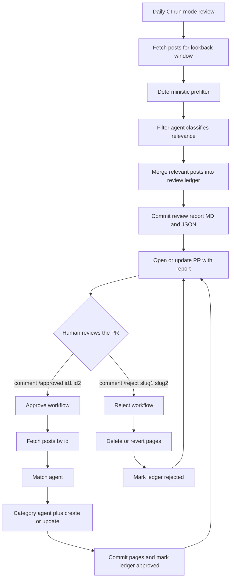

# Plan: review/approve modes for the reddit-pipeline

## Goal

Stop running `match → category → create/update` on posts that were mistakenly
classified as relevant by `filter`. Instead:

1. The daily run works in **review** mode: `fetch → prefilter → filter`, builds a
   report of the relevant posts and opens/updates a pull request with that report.
2. A human reviews the PR and comments `/approved <id1> <id2> ...`.
3. The approve run executes `match → category → create/update` **only** for the
   listed posts and pushes the generated pages into the same PR.

The approval key is the **Reddit post id** (e.g. `1abc2d3`), because at the
`review` stage the real page slug is not known yet (it is produced by the `match`
agent).

## Flow



## Pipeline modes

A new `mode` parameter, configurable at every level (like the other parameters):
CLI `--mode`, env `REDDIT_MODE`, CI input. The default value is `review`.

| Mode | Behaviour |
| --- | --- |
| `review` | `fetch → prefilter → filter`, then record the relevant posts into the review ledger. `match/category/create/update` are not run. |
| `full` | Current behaviour: the full `fetch → filter → match → create/update` cycle. |
| `approve` | Enabled by `--approve <id1,id2>`. Posts are fetched by id via `fetchPostById`, `filter` is skipped, and `match → category → create/update` runs. |

## Review ledger (append, not overwrite)

New module `scripts/reddit-pipeline/pipeline/review/`.

Files (committed to the automation branch):

- `plans/reddit-pipeline-review.json` — machine-readable state;
- `plans/reddit-pipeline-review.md` — human-readable render.

Entry shape:

```ts
interface ReviewPost {
  id: string;            // Reddit post id
  title: string;
  permalink: string;
  createdUtc: number;
  firstSeenAt: string;   // ISO
  status: 'pending' | 'approved' | 'rejected';
  slug?: string;         // set after a successful approve
  decidedAt?: string;    // ISO
}
```

Rules:

- On every run the ledger is **loaded and merged** (upsert by `id`), never
  overwritten.
- A new post → `pending`; an existing one → its status is preserved, while
  `title`/`permalink` are refreshed when they change.
- The `approve` run marks successfully processed posts `approved` and stores the
  `slug`; failed ones stay `pending` with the recorded error.
- The `reject` workflow marks posts `rejected`.
- Markdown render: **Pending / Approved / Rejected** sections; for pending posts —
  `id — title — [source]` plus a ready-to-copy `/approved id1 id2 ...` line.
- Optional: prune decided entries older than a configurable window so the file
  does not grow unbounded.

## Changes by layer

### Config

- `config/lib/types.ts`: type `PipelineMode = 'review' | 'full' | 'approve'`,
  field `mode: PipelineMode` in `RedditConfig`.
- `config/index.ts`: read `REDDIT_MODE` with the default `review`.
- `shared/lib/constants.ts`: `DEFAULT_PIPELINE_MODE = 'review'`, paths
  `REVIEW_FILE` / `REVIEW_MARKDOWN_FILE`.

### CLI

- `lib/types.ts`: `mode?: PipelineMode`, `approveIds?: string[]` in `CliArgs`.
- `lib/args.ts`:
  - `--mode <review|full>` (value validation);
  - `--approve <id1,id2>` (separators: comma and/or space), enables `approve`
    mode;
  - wire into `applyArgs` (mode) and `orchestratorOptionsFromArgs` (approveIds);
  - update `USAGE`.

### Fetch stage

- `pipeline/stages/fetch/lib/types.ts`: `postIds?: readonly string[]`, injectable
  `fetchPostById`.
- `pipeline/stages/fetch/lib/helpers.ts`: when `postIds` is set, fetch each post
  via `fetchPostById`, normalize with `postToReport`, and **do not** apply the
  prefilter; record missing ids as errors.

### Report

- `pipeline/report/lib/types.ts`: new `PostAction` — `relevant`; a `relevant`
  counter in `ReportCounts`; a section in `ReportSummary`.
- `pipeline/report/lib/helpers.ts`: a "Relevant (awaiting approval)" section that
  prints the `id` and a ready-to-copy `/approved ...` line.

### Orchestrator

- `pipeline/orchestrator/lib/types.ts`: `approvePostIds?: readonly string[]` in
  `OrchestratorOptions`.
- `pipeline/orchestrator/lib/helpers.ts`:
  - `review`: after `filter`, record the relevant posts into the ledger and stop;
  - `approve`: `fetch` by id (no prefilter) → `match → create/update`, skipping
    `filter`; update the ledger (`approved` + `slug`);
  - extract the shared `match → create/update` block into a reusable function.

### CI

- `.gitignore`: stop ignoring `plans/reddit-pipeline-review.md` and
  `plans/reddit-pipeline-review.json`; `plans/reddit-pipeline-report.*` stay as
  artifacts.
- `.github/workflows/reddit-pipeline.yml`:
  - input `mode` (choice `review|full`, default `review`), env `REDDIT_MODE`,
    `--mode` flag;
  - commit the review ledger and include it in change detection;
  - PR body with the pending list and the `/approved` hint.
- New `.github/workflows/reddit-pipeline-approve.yml`:
  - `issue_comment` trigger on `/approved <id...>`;
  - permission, fork and target-branch checks (mirroring
    `reddit-pipeline-reject.yml`);
  - checkout the PR branch, run `--approve`, commit/push pages into the same PR,
    post a confirmation comment.
- `.github/workflows/reddit-pipeline-reject.yml`: mark `rejected` in the ledger.

### Documentation and tests

- `scripts/reddit-pipeline/README.md` and `USAGE`: modes, `/approved`, review
  report format.
- Tests: `parseArgs` for `mode`/`approve`, fetch `postIds`, review ledger
  (append/dedupe), orchestrator for `review` and `approve`.

## Implementation checklist

1. Add the `PipelineMode` type and the `mode` field to `RedditConfig`, load it
   from the `REDDIT_MODE` env with the default `review`.
2. Extend the CLI: `--mode review|full` and `--approve id1,id2` in `CliArgs`,
   `parseArgs`, `applyArgs` and `USAGE`.
3. Extend the fetch stage: support `postIds` via `fetchPostById` with the
   prefilter disabled for `approve` mode.
4. Create the `pipeline/review` module: ledger entry types, load, upsert-merge
   without overwrite, Markdown render and save.
5. Extend the report: new `PostAction` `relevant`, a "Relevant (awaiting
   approval)" section with the id and a ready-to-copy `/approved` line.
6. Update the orchestrator: `review` mode stops after `filter` and updates the
   ledger; `approve` mode skips `filter` and runs
   `match → category → create/update`; extract the shared block into a reusable
   function.
7. Update `.gitignore`: stop ignoring `plans/reddit-pipeline-review.md` and
   `.json`, keeping `report.json` and `report.md` as artifacts.
8. Update `reddit-pipeline.yml`: `mode` input defaulting to `review`, env
   `REDDIT_MODE`, `--mode` flag, commit the review report and include it in
   change detection, PR body with the pending list and the `/approved` hint.
9. Create `reddit-pipeline-approve.yml`: `/approved` comment trigger, permission,
   fork and target-branch checks, checkout the PR branch, run with `--approve`,
   commit and push pages, confirmation comment.
10. Mark `rejected` in the ledger from `reddit-pipeline-reject.yml` after a
    successful page rollback.
11. Update the documentation: README and `USAGE` for the modes, `/approved` and
    the review report format.
12. Add tests: `parseArgs` for `mode`/`approve`, fetch `postIds`, review ledger
    append and dedupe, orchestrator for `review` and `approve`.
13. Run `yarn tsc`, `yarn lint` and `yarn test`.
